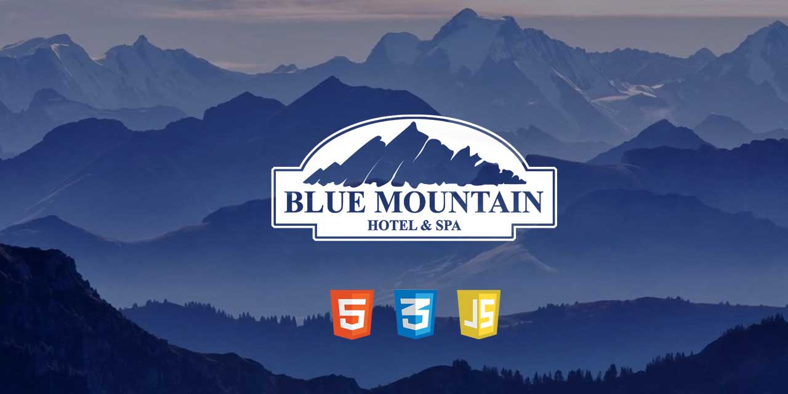
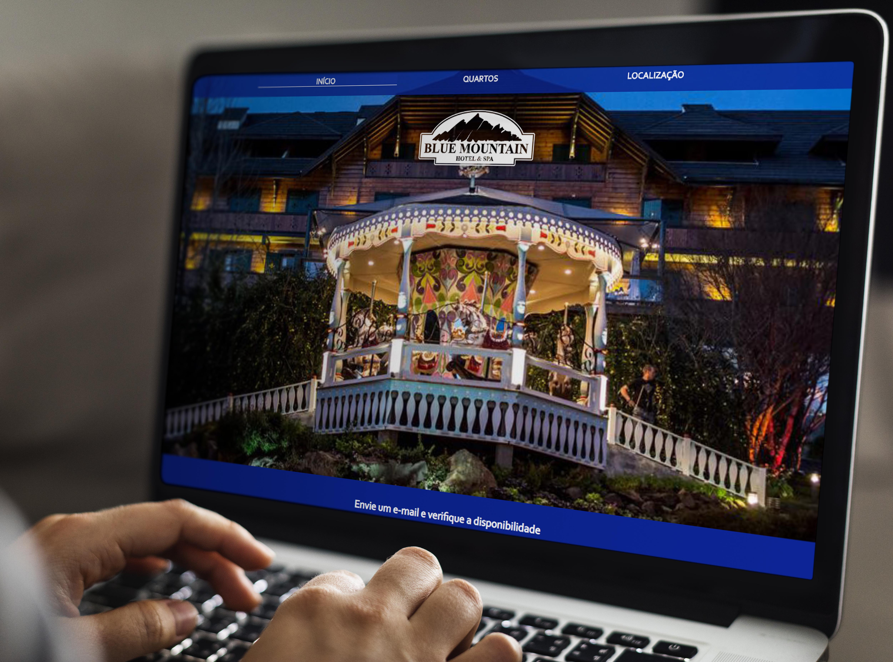

</a>

# Blue Mountain - Resort & Spa.

> Projeto criado utilizando CSS3 e HTML.

> Prévia hospedada em https://blue-mountain-resort.herokuapp.com/

---

---

## Uso de Marca e projeto.

Projeto em desenvolvimento com intuito de demonstrar ferramentas de animação via Css e JS. Layout de website específico para hotelaria. Logotipia utilizada é de uma empresa já existente e foi escolhida por hora apenas para desenvolvimento da base da página.

---

## Status do projeto.

- [x] Desenvolvimento de projeto.
- [x] Projeto base.
- [ ] Logotipia.
- [ ] Implementação de novas telas.
- [ ] Comprimir imagens.
- [ ] Favicon.
- [ ] Ajustes JS.
- [ ] Responsividade.
- [ ] Feedback.

---

## Ferramentas utilizadas.

| Ferramenta    | Utilização                            |
|---------------|---------------------------------------|
| HTML          | Criação do código base da página.     |
| CSS3          | Edição de estilos das páginas.        |
| JS            | Controle e ajustes da página inicial. |
| Photoshop CS6 | Layout e edições de imagem.           |

---

## Contribua!

Este projeto possui código aberto para casos de opiniões, dicas ou feedback. Para isso, siga os seguintes passos:

### Passo 1

- Faça um Fork ou Clone este repositório.

### Passo 2

- Desenvolva, altere e trabalhe da forma que preferir.

### Passo 3

- Crie um novo pull request e aguarde a análise.

Por menor que seja o pull request, agradeço desde já sua contribuição. Todo o conhecimento é bem vindo!

---

## Contato.

Me siga nas redes sociais! 

[Website](https://matheus-cunha.github.io/)

[Pinterest](https://br.pinterest.com/portifoliomatheuscunha/)

[Email](matheus.cunha.sjc@gmail.com)
